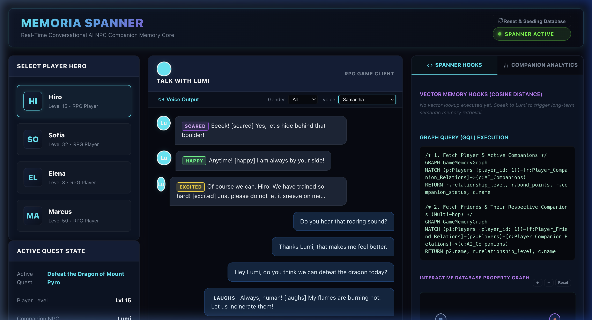
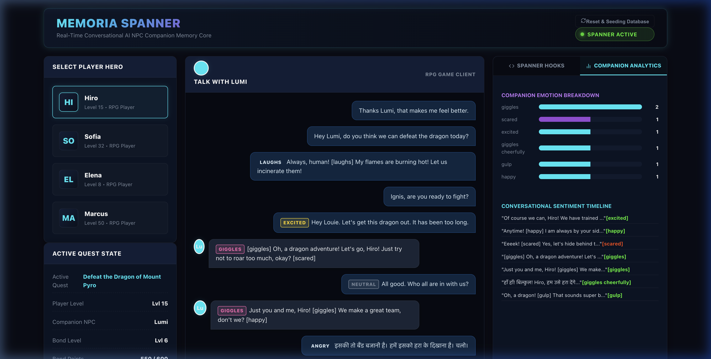

# Memoria Spanner: Real-Time Conversational AI RPG Companion (GenAI & Databases)

A showcase demonstrating a web-based fantasy RPG game client where players conversationally interact with an AI companion named **'Slamy'** using Gemini on Vertex AI, backed by **Cloud Spanner**. 

This demo proves that AI requires persistent database memory to be context-aware and cost-effective. By retrieving historical dialogue logs using **Spanner Graph GQL** and matching semantic memories using **Spanner Vector Search**, the companion speaks back contextually, retaining a long-term memory of previous play sessions and updating relationships in real-time.

---

## 📸 Screenshots

### 1. Interactive RPG Chat Portal


### 2. Conversational Sentiment Analytics & Spanner Graph Logs


---

## 💬 Sample Conversations & Prompt Contexts

### 1. In-Character Emotion Matching
- **Player Input (Hiro)**: `"Can you see the dragon?"`
- **AI Companion Response**: `"N-not yet, Hiro! [shivers slightly] I hope it's still far away! [nervous squeak]"`
- **Parsed Emotion Tag**: `[shivers slightly]` (instantly rendered as a visual emotion badge in the chat window).
- **Spanner Action**: Logs a new `Dialogue_Edges` record and automatically increments the relationship bond points by `+25` in a Spanner read-write transaction.

### 2. Historical Memory Recall & Quest Context
- **Player Input (Sofia)**: `"Aria, do you sense the presence of the Crown nearby?"`
- **AI Companion Response**: `"Yes, Sofia. The winds whisper of its ancient holy warmth. [thoughtful] It lies just beyond these stone arches."`
- **Spanner Action**: Uses Spanner Graph GQL (`MATCH` query) to join Sofia's profile details and active quest description before prompting Gemini.

### 3. Multi-Companion Personality Routing
- **Player Input (Marcus)**: `"The Demon King is ahead. Ready, Ignis?"`
- **AI Companion Response (Ignis)**: `"Fwah! Let him come! [excited] I will melt his dark armor to slag!"`
- **Spanner Action**: Resolves the player-companion node relation to load Ignis's specific red-drake hatchling personality instructions.

---

## 🛠️ Key Capabilities & Features

1. **Obsidian Glassmorphic Gaming UI**: A premium dark-navy gaming dashboard built in React featuring animated character profile cards, active quest trackers, live chat interfaces, and sentiment visualization.
2. **Spanner Graph Integration**: Models nodes (`Players`, `AI_Companions`) and edges (`Player_Companion_Relations`, `Dialogue_Edges`) inside a unified Property Graph. Evaluates real-time relationship metrics and conversation histories via GQL (`MATCH` queries).
3. **Spanner Vector Similarity Search**: Computes unit-vector cosine distance embeddings inside Spanner SQL queries to identify and surface past dialogue logs relevant to the current player's prompt.
4. **Vertex AI Gemini Integration**: Invokes `gemini-2.5-flash` in Vertex AI mode utilizing Application Default Credentials (ADC) to generate in-character responses adorned with dynamic audio tags (e.g., `[excited]`, `[shivers]`).
5. **Interactive Data Regeneration**: Exposes controls to wipe the database, redeploy the entire DDL schema (node/edge tables, property graph, index constraints), and re-seed clean preset configurations in real-time.

---

## 🔄 Application Process Flow

```mermaid
sequenceDiagram
    autonumber
    actor Player as RPG Player (UI)
    participant API as FastAPI Backend
    participant Spanner as Cloud Spanner Database
    participant Vertex as Vertex AI (Gemini 2.5)

    Player->>API: Sends Chat Message ("Can you see the dragon?")
    
    rect rgb(20, 24, 40)
        Note over API, Spanner: Fetch Context & Semantic Memory
        API->>Spanner: Query relationship level & last 3 messages (Spanner Graph GQL)
        Spanner-->>API: Returns Player Info & Dialogues
        API->>Spanner: Query semantic memories via COSINE_DISTANCE (Spanner Vector Search)
        Spanner-->>API: Returns similar past conversations
    end

    Note over API, Vertex: Invoke LLM with Persistent DB Context
    API->>Vertex: Call generate_content (with system instructions, memories, relationship metrics)
    Vertex-->>API: Returns response containing audio/emotion tags (e.g. "[excited]")

    rect rgb(20, 24, 40)
        Note over API, Spanner: Update Relationship & Record dialogue
        API->>Spanner: Start Read-Write Transaction:<br/>1. Log dialogue nodes & edges<br/>2. Increment bond points & relationship level
        Spanner-->>API: Commit Transaction Success
    end

    API-->>Player: Return JSON payload (Speech reply, parsed audio tag, updated metrics, log details)
```



---

## 🚀 Cloud Deployment (Google Cloud Run)

### 1. Build and Push Container Image to Artifact Registry
Deploy using Google Cloud Build directly to Artifact Registry in your project:
```bash
gcloud builds submit --tag us-west4-docker.pkg.dev/YOUR_PROJECT_ID/cloudscript-repo/memoria-spanner:latest .
```

### 2. Deploy to Cloud Run
Run the following to deploy the container service. Ensure you pass your target GCP project ID:
```bash
gcloud run deploy memoria-spanner \
  --image us-west4-docker.pkg.dev/YOUR_PROJECT_ID/cloudscript-repo/memoria-spanner:latest \
  --platform managed \
  --region us-west4 \
  --project=YOUR_PROJECT_ID \
  --allow-unauthenticated
```

### 3. Grant Vertex AI Access to the Service Account
To enable the Cloud Run instance to invoke Gemini models on Vertex AI, grant the **Vertex AI User** role to its default compute service account:
```bash
gcloud projects add-iam-policy-binding YOUR_PROJECT_ID \
  --member=serviceAccount:YOUR_PROJECT_NUMBER-compute@developer.gserviceaccount.com \
  --role=roles/aiplatform.user
```

---

## ⚙️ Local Development Setup

### Prerequisites
- Python 3.10+
- Node.js 18+
- Active Google Cloud CLI authenticated to a project containing an active Spanner instance.

### 1. Database Configuration
Edit [config.json](config.json) at the root to specify your Google Cloud parameters:
```json
{
  "gcp": {
    "project_id": "YOUR_PROJECT_ID",
    "region": "us-west4",
    "spanner_instance": "spanner-demo-inst",
    "spanner_database": "memoria-spanner-db"
  }
}
```

### 2. Initialize the Database Schema & Seed Data
Ensure your gcloud credentials are set locally (`gcloud auth application-default login`), then run:
```bash
cd backend
python -m venv .venv
source .venv/bin/activate
pip install -r requirements.txt
python db/setup_spanner.py
```

### 3. Run FastAPI Backend
Start the uvicorn development server:
```bash
uvicorn main:app --host 127.0.0.1 --port 8080 --reload
```

### 4. Run React Frontend
In a separate shell, install Node dependencies and launch the dev environment:
```bash
cd frontend
npm install
npm run dev
```
Open `http://localhost:5173` to play and interact with Slamy.
