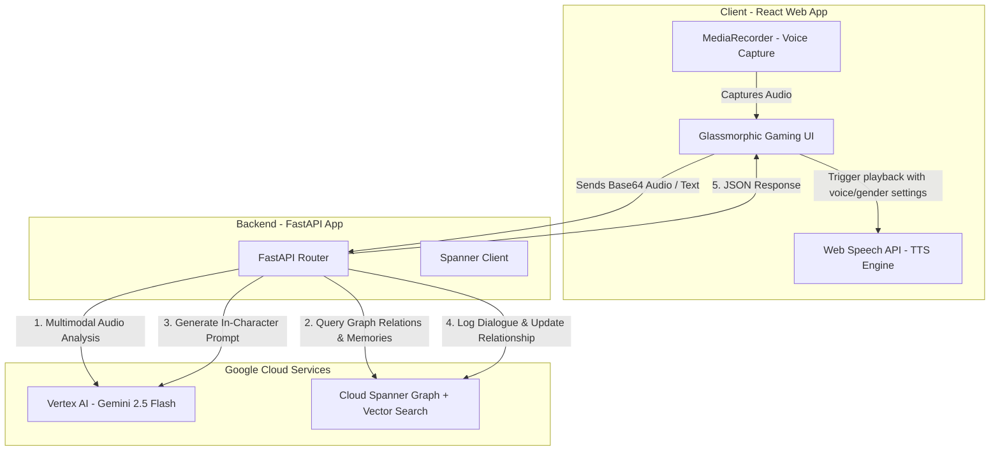

# Memoria Spanner: Real-Time Conversational AI RPG Companion with Voice Sentiment Analysis

A showcase demonstrating a web-based fantasy RPG game client where players conversationally interact with an AI companion named **'Lumi'** via text or voice. Powered by **Gemini 2.5 Flash on Vertex AI** (for multimodal speech transcription and vocal sentiment analysis) and backed by **Cloud Spanner Graph** & **Vector Similarity Search** for long-term memory.

---

## 📸 Screenshots

### 1. Interactive RPG Chat Portal


### 2. Conversational Sentiment Analytics & Spanner Graph Logs


---

## 💬 Sample Conversations & Prompt Contexts

### 1. In-Character Emotion Matching
- **Player Input (Hiro)**: `"Can you see the dragon?"`
- **AI Companion Response**: `"N-not yet, Hiro! [shivers slightly] I hope it's still far away! [nervous squeak]"`
- **Parsed Emotion Tag**: `[shivers slightly]` (instantly rendered as a visual emotion badge in the chat window).
- **Spanner Action**: Logs a new `Dialogue_Edges` record and automatically increments the relationship bond points by `+25` in a Spanner read-write transaction.

### 2. Historical Memory Recall & Quest Context
- **Player Input (Sofia)**: `"Aria, do you sense the presence of the Crown nearby?"`
- **AI Companion Response**: `"Yes, Sofia. The winds whisper of its ancient holy warmth. [thoughtful] It lies just beyond these stone arches."`
- **Spanner Action**: Uses Spanner Graph GQL (`MATCH` query) to join Sofia's profile details and active quest description before prompting Gemini.

### 3. Multi-Companion Personality Routing
- **Player Input (Marcus)**: `"The Demon King is ahead. Ready, Ignis?"`
- **AI Companion Response (Ignis)**: `"Fwah! Let him come! [excited] I will melt his dark armor to slag!"`
- **Spanner Action**: Resolves the player-companion node relation to load Ignis's specific red-drake hatchling personality instructions.

### 4. Voice Input & Vocal Sentiment Analysis
- **Player Input (Vocal Speech)**: (Player records audio message: `"Lumi, is that a monster behind the tree?"` with a worried tone)
- **Voice Transcription**: `"Lumi, is that a monster behind the tree?"`
- **Vocal Tone Sentiment**: `[scared]` (extracted directly from the voice audio by Gemini 2.5 Flash).
- **AI Companion Response**: `"Eeeek! [scared] I-I think so, Hiro! Let's hide!"`
- **Spanner Action**: Inserts dialogue nodes for both speaker turns. The player's turn is stored with their vocal sentiment tag (`[scared]`), and Lumi's turn is stored with their emotion tag (`[scared]`), which automatically updates relation stats in Spanner.

---

## 🛠️ Key Capabilities & Features

1. **Obsidian Glassmorphic Gaming UI**: A premium dark-navy gaming dashboard built in React featuring character profile cards, active quest trackers, live chat interfaces with text and voice (microphone) recording, interactive property graph visualizations, and client-side companion TTS voice settings.
2. **Multimodal Voice Sentiment Analysis**: Captures the player's microphone audio input, converts it to base64, and uses Gemini 2.5 Flash's native audio understanding to transcribe the words and analyze the speaker's vocal tone sentiment (mapping to excited, happy, neutral, scared, thoughtful, sad, or angry).
3. **Spanner Graph Integration**: Models nodes (`Players`, `AI_Companions`) and edges (`Player_Companion_Relations`, `Dialogue_Edges`) inside a unified Property Graph. Evaluates real-time relationship metrics and conversation histories via GQL (`MATCH` queries).
4. **Spanner Vector Similarity Search**: Computes unit-vector cosine distance embeddings inside Spanner SQL queries to identify and surface past dialogue logs relevant to the current player's prompt.
5. **Vertex AI Gemini Integration**: Invokes `gemini-2.5-flash` in Vertex AI mode to perform voice analysis and generate in-character responses adorned with dynamic emotion/speech tags.
6. **Interactive Data Regeneration**: Exposes controls to wipe the database, redeploy the entire DDL schema (node/edge tables, property graph, index constraints), and re-seed clean preset configurations in real-time.
7. **Client-Side Text-To-Speech (TTS)**: Integrates browser speech synthesis to play Lumi's responses. Includes customizable controls to toggle voice output on/off, filter available system voices by gender (All, Female, Male), and pick specific voices, while dynamically cleaning raw emotion tags for natural playback.

---

## 📋 System Requirements

To run this demo successfully, ensure you meet the following requirements:
1. **Google Cloud Platform (GCP)**:
   - An active GCP Project.
   - Cloud Spanner Instance and Database.
   - Vertex AI API enabled (for Gemini 2.5 Flash).
   - Local authentication configured via Application Default Credentials (`gcloud auth application-default login`).
2. **Local Environment**:
   - Python 3.10+ (for FastAPI backend and setup script).
   - Node.js 18+ (for building the React frontend).
3. **Web Browser**:
   - A modern browser that supports the **Web Speech API** (for client-side TTS playback and voice listing) and **MediaRecorder API** (for capturing microphone audio). Chrome, Edge, or Safari are recommended.

---

## 🏗️ Architecture & Component Design

The application uses a 3-tier architecture designed for low-latency, real-time gaming companionship:



### Key Architectural Flow:
1. **Input Delivery**: The user speaks (capturing base64 WebM audio) or types in the RPG interface.
2. **Cognitive Parsing**: If it's audio, the backend sends the raw audio bytes to Gemini 2.5 Flash to simultaneously transcribe the text and analyze the speaker's vocal sentiment (e.g. Scared, Angry, Happy).
3. **Memory Retrieval**: The backend runs two queries on Cloud Spanner:
   - A **GQL Graph query** to fetch current companion relations (friend recommendations, bond levels).
   - A **Vector Similarity Search** using cosine distance to retrieve contextually relevant dialogues.
4. **Contextual Reply**: Vertex AI generates the companion response, embedded with natural emotion tags.
5. **Database Sync**: The backend commits a write transaction logging the dialogue edges and updating relationship stats in Spanner.
6. **Voice Synthesis**: The client receives the text reply and uses the browser's Web Speech synthesis, respecting user-selected voice gender and specific system voice selectors, to read the cleaned response.

---

## 🧩 Key Components Used

- **Frontend Core**: React (Hooks, state management for presets, messages, and configurations), CSS Glassmorphism.
- **Microphone & Voice Capture**: Web MediaRecorder API to record raw audio snippets and encode them to Base64.
- **Voice Synthesis (TTS)**: Web Speech Synthesis API (`window.speechSynthesis`), allowing custom browser voice listing, filtering by voice gender attributes (mapping names to genders), and playback speech rate controls.
- **Backend API**: FastAPI (Python), serving static frontend builds and hosting CORS-compliant routes.
- **AI Core**: Vertex AI SDK for Python (`google-genai` client), calling the `gemini-2.5-flash` model with system instructions and JSON schemas for structured audio analysis outputs.
- **Memory Core**: Google Cloud Spanner (`google-cloud-spanner`), utilizing its integrated Property Graph (GQL MATCH queries) and SQL Vector Search (`COSINE_DISTANCE`) features.

---

## 🔄 Application Process Flow

```mermaid
sequenceDiagram
    autonumber
    actor Player as RPG Player (UI)
    participant API as FastAPI Backend
    participant Spanner as Cloud Spanner Database
    participant Vertex as Vertex AI (Gemini 2.5)

    alt Voice Chat Input
        Player->>API: Sends Base64 Voice Audio (audio/webm)
        API->>Vertex: Call generate_content (with Audio Bytes + transcription/sentiment prompt)
        Vertex-->>API: Returns Structured JSON (transcription & vocal sentiment tag)
    else Text Chat Input
        Player->>API: Sends Chat Message Text ("Can you see the dragon?")
    end
    
    rect rgb(20, 24, 40)
        Note over API, Spanner: Fetch Context & Semantic Memory
        API->>Spanner: Query relationship level & last 3 messages (Spanner Graph GQL)
        Spanner-->>API: Returns Player Info & Dialogues
        API->>Spanner: Query semantic memories via COSINE_DISTANCE (Spanner Vector Search)
        Spanner-->>API: Returns similar past conversations
    end

    Note over API, Vertex: Invoke LLM with Persistent DB Context
    API->>Vertex: Call generate_content (with system instructions, memories, relationship metrics)
    Vertex-->>API: Returns response containing audio/emotion tags (e.g. "[excited]")

    rect rgb(20, 24, 40)
        Note over API, Spanner: Update Relationship & Record dialogue
        API->>Spanner: Start Read-Write Transaction:<br/>1. Log dialogue nodes & edges (including player voice sentiment)<br/>2. Increment bond points & relationship level
        Spanner-->>API: Commit Transaction Success
    end

    API-->>Player: Return JSON payload (Transcription, user sentiment, reply, companion tag, updated metrics, log details)
    Note over Player: Play spoken audio reply (TTS) using Web Speech API<br/>(if Voice Output is enabled, using selected gender/voice)
```



---

## 🚀 Cloud Deployment

You can deploy the entire demo (Cloud Spanner instance, Spanner Database, IAM Roles, and Cloud Run service) either automatically using Terraform or manually using the `gcloud` CLI.

### Option 1: Automatic Deployment via Terraform (Recommended)

Terraform will automatically provision your Cloud Spanner instance, database, dedicated IAM Service Account, Artifact Registry, and Cloud Run service.

#### Prerequisites
- Installed [Terraform CLI](https://developer.hashicorp.com/terraform/tutorials/aws-get-started/install-cli).
- Authorized Application Default Credentials:
  ```bash
  gcloud auth application-default login
  ```

#### Deployment Steps

1. **Configure variables**:
   Edit [terraform/terraform.tfvars](terraform/terraform.tfvars) and replace `"ENTER_YOUR_PROJECT_ID_HERE"` with your GCP Project ID. Optionally change the region (defaults to `us-west4`).

2. **Initialize and provision the Artifact Registry**:
   To prevent Cloud Run deployment failure, we first provision the Artifact Registry repository so we can push the container image:
   ```bash
   cd terraform
   terraform init
   terraform apply -target=google_artifact_registry_repository.demo_repo
   ```

3. **Build and push the container image**:
   Return to the project root directory and build/push the Docker image to your newly created registry:
   ```bash
   cd ..
   gcloud builds submit --tag us-west4-docker.pkg.dev/YOUR_PROJECT_ID/cloudscript-repo/memoria-spanner:latest .
   ```
   *(Note: Adjust the region `us-west4` and `YOUR_PROJECT_ID` if customized in your `terraform.tfvars`).*

4. **Deploy the remaining resources**:
   Deploy Spanner, IAM roles, and the Cloud Run service:
   ```bash
   cd terraform
   terraform apply
   ```

5. **Initialize Database Schema**:
   Once complete, Terraform will output your `service_url`. Open this URL in your browser and use the **Database Schema / Re-seed** -> **Wipe & Regenerate Database** button to populate the Spanner Graph schema and presets.

---

### Option 2: Manual Deployment via `gcloud` CLI

#### 1. Build and Push Container Image to Artifact Registry
Create an Artifact Registry repository manually first (e.g., `cloudscript-repo`), then deploy using Google Cloud Build:
```bash
gcloud builds submit --tag us-west4-docker.pkg.dev/YOUR_PROJECT_ID/cloudscript-repo/memoria-spanner:latest .
```

#### 2. Deploy to Cloud Run
Run the following to deploy the container service. Ensure you pass your target GCP project ID:
```bash
gcloud run deploy memoria-spanner \
  --image us-west4-docker.pkg.dev/YOUR_PROJECT_ID/cloudscript-repo/memoria-spanner:latest \
  --platform managed \
  --region us-west4 \
  --project=YOUR_PROJECT_ID \
  --allow-unauthenticated
```

#### 3. Grant Vertex AI Access to the Service Account
To enable the Cloud Run instance to invoke Gemini models on Vertex AI, grant the **Vertex AI User** role to its default compute service account:
```bash
gcloud projects add-iam-policy-binding YOUR_PROJECT_ID \
  --member=serviceAccount:YOUR_PROJECT_NUMBER-compute@developer.gserviceaccount.com \
  --role=roles/aiplatform.user
```

---

## ⚙️ Local Development Setup

### Prerequisites
- Python 3.10+
- Node.js 18+
- Active Google Cloud CLI authenticated to a project containing an active Spanner instance.

### 1. Database Configuration
Edit [config.json](config.json) at the root to specify your Google Cloud parameters:
```json
{
  "gcp": {
    "project_id": "YOUR_PROJECT_ID",
    "region": "us-west4",
    "spanner_instance": "spanner-demo-inst",
    "spanner_database": "memoria-spanner-db"
  }
}
```

### 2. Initialize the Database Schema & Seed Data
Ensure your gcloud credentials are set locally (`gcloud auth application-default login`), then run:
```bash
cd backend
python -m venv .venv
source .venv/bin/activate
pip install -r requirements.txt
python db/setup_spanner.py
```

### 3. Run FastAPI Backend
Start the uvicorn development server:
```bash
uvicorn main:app --host 127.0.0.1 --port 8080 --reload
```

### 4. Run React Frontend
In a separate shell, install Node dependencies and launch the dev environment:
```bash
cd frontend
npm install
npm run dev
```
Open `http://localhost:5173` to play and interact with Lumi.
